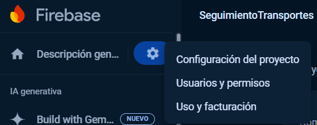

# **Guía de Uso de Firebase en React**

### **Introducción a Firebase**

Firebase es una plataforma de desarrollo de aplicaciones web y móviles de Google que ofrece una variedad de herramientas y servicios, como bases de datos en tiempo real, autenticación de usuarios, almacenamiento de archivos. Es un [Backend as a service](https://www.cloudflare.com/es-es/learning/serverless/glossary/backend-as-a-service-baas/) popular y agradable para desarrolladores que buscan integrar backend con sus aplicaciones sin tener que gestionar la infraestructura.

### **Módulos de Firebase**

Firebase se compone de diferentes módulos, cada uno de los cuales ofrece un servicio específico:

- **Authentication:** Gestión de usuarios y autenticación.
- **Firestore:** Base de datos en tiempo real basada en documentos.
- **Realtime Database:** Base de datos en tiempo real basada en nodos.
- **Storage:** Almacenamiento de archivos.
- **Functions:** Funciones backend serverless.
- **Hosting:** Alojamiento para aplicaciones web estáticas.

Cada módulo puede ser utilizado de forma independiente o combinada según las necesidades de tu proyecto.

### **Instalación de Firebase en un Proyecto React**

Primero, debes instalar Firebase en tu proyecto React. Ejecuta el siguiente comando en la raíz de tu proyecto:

```bash
npm install firebase
```

### **Configuración de Firebase**

Una vez instalado, es necesario configurar Firebase en tu aplicación. Lo recomendable es almacenar las credenciales y configuraciones sensibles en variables de entorno para mantener la seguridad de tu proyecto.

1. **Crear un archivo `.env`:**

   Crea un archivo `.env` en la raíz de tu proyecto React. Aquí es donde almacenarás tus claves y configuraciones de Firebase. En el caso de no encontrar tu configuración puedes buscar en Configuración del proyecto en la consola de firebase.

   

   ```plaintext
   REACT_APP_FIREBASE_API_KEY=your-api-key
   REACT_APP_FIREBASE_AUTH_DOMAIN=your-auth-domain
   REACT_APP_FIREBASE_PROJECT_ID=your-project-id
   REACT_APP_FIREBASE_STORAGE_BUCKET=your-storage-bucket
   REACT_APP_FIREBASE_MESSAGING_SENDER_ID=your-messaging-sender-id
   REACT_APP_FIREBASE_APP_ID=your-app-id
   ```

> [!IMPORTANT]  
> Recuerda añadir este archivo `.env` a tu `.gitignore`

2. **Inicializar Firebase:**

   Dentro de tu archivo de configuración (por ejemplo, `firebase.js` o `config.js`), importa Firebase y utiliza las variables de entorno para inicializarlo.

   ```javascript
   // firebase.js
   import { initializeApp } from "firebase/app";

   const firebaseConfig = {
     apiKey: process.env.REACT_APP_FIREBASE_API_KEY,
     authDomain: process.env.REACT_APP_FIREBASE_AUTH_DOMAIN,
     projectId: process.env.REACT_APP_FIREBASE_PROJECT_ID,
     storageBucket: process.env.REACT_APP_FIREBASE_STORAGE_BUCKET,
     messagingSenderId: process.env.REACT_APP_FIREBASE_MESSAGING_SENDER_ID,
     appId: process.env.REACT_APP_FIREBASE_APP_ID,
   };

   const app = initializeApp(firebaseConfig);

   export default app;
   ```

### **Referencias del Servicio**

Para utilizar un servicio específico de Firebase, debes crear una referencia a ese servicio en tu proyecto.

- **Autenticación:**

   ```javascript
   import { getAuth } from "firebase/auth";
   const auth = getAuth(app);
   ```

- **Firestore:**

   ```javascript
   import { getFirestore } from "firebase/firestore";
   const db = getFirestore(app);
   ```

- **Storage:**

   ```javascript
   import { getStorage } from "firebase/storage";
   const storage = getStorage(app);
   ```

Puedes consultar la documentación oficial de Firebase para más detalles sobre cómo utilizar cada módulo:

- [Firebase Authentication](https://firebase.google.com/docs/auth)
- [Firestore](https://firebase.google.com/docs/firestore)
- [Firebase Storage](https://firebase.google.com/docs/storage)